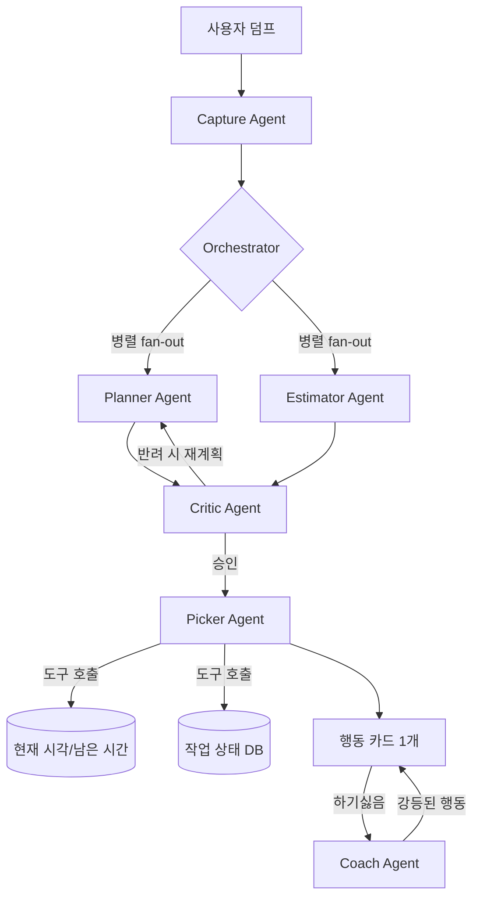

# 지금 이거만 — Next Action 에이전트

> **"오늘 뭐 하지?"를 없애는 개인 생산성 에이전트**
> 해커톤 최종 기획안 · 남은 시간 ~5시간 기준

---

## 1. 문제 정의

개인 생산성의 병목은 두 가지뿐이다.

| 대상 | 병목 |
| --- | --- |
| 열심히 사는 사람 | **다음에 뭘 할지 다시 고르느라** 시간이 샌다 (결정 피로) |
| 모든 게 귀찮은 사람 | **시작 에너지**가 없어서 아예 안 한다 (착수 장벽) |

할 일 앱은 목록을 보여줄 뿐, 결정과 착수를 대신하지 않는다.

## 2. 솔루션

머릿속·메모·할 일을 막 던지면, 에이전트 팀이 **다음 물리적 행동 1개**만 남긴다.

```
막 던지기 → 에이전트 처리 → 행동 1개 제시 → [했음/다음에/하기싫음] → 즉시 다음 행동
```

| 모드 | 효과 |
| --- | --- |
| **과속 모드** | 끝난 즉시 다음 행동이 이미 준비됨. 같은 1시간에 완료 개수 증가 |
| **최소 모드** | 오늘 1개 + 30초짜리 첫 행동만 제시. "하기 싫음"이 사라져 착수가 됨 |

예시: "보고서, 메일, 장보기, 운동…"
- 과속: `개요 3줄 쓰기` → 했음 → 즉시 `본론 초안`
- 최소: `제목만 적기`

## 3. 멀티 에이전트 아키텍처 (핵심 차별점)



### 에이전트 6개

| 에이전트 | 역할 |
| --- | --- |
| **Capture** | 자연어 덤프를 구조화 (작업·마감·예상시간·에너지 요구량 추출) |
| **Planner** | 큰 일을 물리적 행동 단위로 분해 (`보고서` → `개요 3줄 쓰기`) |
| **Estimator** | 소요시간·에너지 추정 (Planner와 병렬 실행) |
| **Critic** | Planner 결과 검증. 추상적 행동 반려, 최대 2회 재계획 요구 |
| **Picker** | 도구 호출로 시각·이력 조회 후 딱 1개 선정 + 선정 이유 명시 |
| **Coach** | "하기싫음" 시 30초 최소 행동으로 강등. 3회 거부 시 오늘 포기 제안 |

### 오케스트레이션 패턴 4가지 (Agent Framework 어필)

1. **병렬 Fan-out/Fan-in** — Planner ∥ Estimator 동시 실행으로 지연 감소
2. **Critic 루프** — 자기 검증·재계획 (환각 완화 사례로도 어필)
3. **도구 호출** — `get_time_context()`, `get_task_history()`, `record_decision()` — 모델이 추측하지 않고 사실을 조회
4. **동적 핸드오프** — 사용자 반응에 따라 Orchestrator가 Coach로 라우팅

### 공유 컨텍스트
모든 에이전트가 하나의 세션 상태(작업 목록, 모드, 거부 이력, 남은 시간)를 읽고 자기 결과를 추가 — Agent Framework의 shared state 활용.

## 4. UX (단일 페이지, 3개 상태)

1. **덤프 화면** — 큰 텍스트박스 하나. "머릿속을 비우세요"
2. **처리 중** — 에이전트 작업 과정 실시간 스트리밍:
```
  ✅ Capture — 6개 작업 인식
   ⏳ Planner ∥ Estimator — 병렬 분해 중...
   🔁 Critic — "보고서 작성" 반려, 재분해 요청
   ✅ Picker — get_time_context() 호출...
```
3. **행동 카드** — 행동 1개 + 선정 이유 1줄 + 버튼 3개(했음/다음에/하기싫음)

"했음" 클릭 시 지연 없이 즉시 다음 카드 → 속도감이 UX 핵심.

## 5. 기술 스택

| 레이어 | 선택 |
| --- | --- |
| 프론트 | React + Vite 단일 페이지 (반응형 웹) |
| 백엔드 | 단일 API 서버 — **GitHub Copilot SDK**(모델 연결·스트리밍) + **Microsoft Agent Framework**(오케스트레이션·도구 호출) |
| 배포 | **Azure Container Apps** |
| 저장 | **Azure Table Storage** (작업 상태·거부 이력) |
| 관찰성 | **Application Insights** (요청시간·완료율·에이전트별 지연 로깅) |

Azure는 이 3개만 — 과잉 서비스 추가는 감점 요인이므로 배제.

## 6. 평가 기준 대응

| 평가 항목 (가중치) | 대응 |
| --- | --- |
| Copilot SDK + Agent Framework (25%) | 에이전트 6개 · 오케스트레이션 패턴 4종 · 도구 호출 · 스트리밍 · 공유 컨텍스트 |
| 생산성 효과 (18%) | 결정 피로·착수 장벽이라는 보편적 문제. "오늘 뭐 하지" 소요 시간 제거 |
| Azure 통합 (18%) | Container Apps 실배포 + Table Storage + App Insights (필요한 만큼만) |
| 완성도 (16%) | 덤프→행동→완료 루프가 끝까지 동작. 반응형 웹 |
| UX (12%) | 버튼 3개 초저마찰 UI, 에이전트 진행 상태 스트리밍, 즉시 다음 카드 |
| 책임 있는 AI (6%) | 선정 이유 투명 표시, Critic의 환각 완화, AI 생성 표시, 사용자가 항상 거부권 보유 |
| 혁신성 (5%) | 할 일 앱이 아니라 **결정과 착수를 대신하는 에이전트** |

## 7. 개발 타임라인 (~5시간)

| 시간 | 작업 |
| --- | --- |
| 0:00–0:45 | 스캐폴딩 + Copilot SDK 모델 연결 확인 |
| 0:45–2:45 | 에이전트 6개 + 오케스트레이션 4패턴 + 스트리밍 API |
| 2:45–3:45 | UI 3개 상태 + 버튼 루프 |
| 3:45–4:30 | Azure 배포 + App Insights |
| 4:30–5:00 | 데모 리허설 + 엣지 케이스 + 버퍼 |

## 8. 데모 스크립트 (90초)

1. "보고서, 메일 답장, 장보기, 운동…" 붙여넣기
2. 에이전트들이 병렬 분해·Critic 반려·도구 호출하는 과정 스트리밍으로 보여주기
3. 과속 모드: `개요 3줄 쓰기` → 했음 → 즉시 `본론 초안`
4. 최소 모드 전환 → 하기싫음 → Coach가 `제목만 적기`로 강등
5. App Insights 대시보드로 관찰성 시연

### 발표 한 줄
> **"지금 이거만은 할 일을 관리하지 않습니다. 결정과 착수를 대신합니다."**
